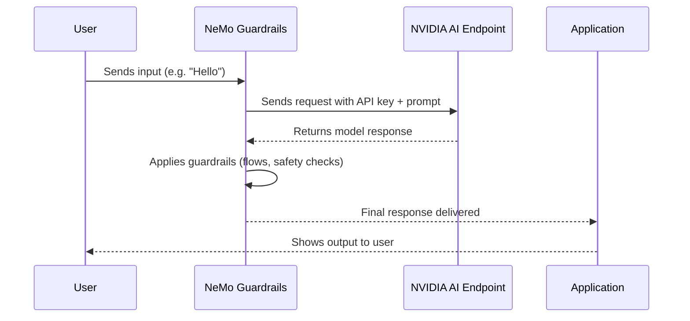

# NIM in NeMo Guardrails
- NIM stands for NVIDIA Inference Microservice.

- It’s NVIDIA’s way of packaging a foundation model (like Llama, Mistral, Nemotron, etc.) inside a containerized microservice that you can run locally (on your GPU) or access via the NVIDIA API Catalog.

- Each NIM exposes a standard API (OpenAI-compatible) for text generation, embeddings, reranking, etc.

- So, instead of worrying about installing models manually, you can just pull/run a NIM container or call it through an NVIDIA-hosted endpoint.

## How it relates to NeMo Guardrails
- NeMo Guardrails is a framework for adding “guardrails” (safety, conversation flows, business logic) around LLMs.

- Guardrails itself doesn’t require a specific model provider. It can plug into OpenAI, Anthropic, Hugging Face, Ollama, or NVIDIA NIM.

- If you configure your config.yml to point to an NVIDIA model, that’s when you use a NIM. Example:
```yaml
models:
  - type: main
    engine: openai
    model: gpt-4

  - type: main
    engine: nim
    model: meta/llama3-70b-instruct
    api_key: ${NVIDIA_API_KEY}

```
Here, engine: nim tells Guardrails:

👉 “Use NVIDIA’s hosted inference microservice for this model.”

## Why NVIDIA introduced NIMs
- To make models easy to deploy (on-prem, cloud, or hybrid).

- To unify the API surface (so you can swap models with minimal code change).

- To offer optimized GPU inference and enterprise support.

✅ So in short:
NIM = NVIDIA Inference Microservice (a packaged model service).
In NeMo Guardrails, "nim" is just one of the supported backends you can point your guardrails to.

## Using NVIDIA AI Endpoints with NeMo Guardrails

This project is configured to use **NVIDIA’s hosted LLMs** (via NVIDIA AI Endpoints) instead of local models such as Ollama.  
With the following config in `config.yml`:

```yaml
models:
  - type: main
    engine: nvidia_ai_endpoints
    model: meta/llama-3.3-70b-instruct
```
## 1. Prerequisites

Before running this project, make sure you have the following:

1. **An NVIDIA account**  
   You can create or log in here: [NVIDIA Account / API Keys](https://org.ngc.nvidia.com/setup/api-keys)

2. **An NVIDIA API key**  
   - Free to generate.  
   - Usage is credit-based with free trial credits.  

3. **Export the key in your environment**  

   On Linux or macOS terminal:

   ```bash
   export NVIDIA_API_KEY="your_api_key_here"

## How It Works

When a user sends input, Guardrails:

1. Wraps the message and Colang flow context into an OpenAI-style `messages` array.  
2. Calls NVIDIA’s hosted API: 
   ```bash
   POST https://api.nvidia.com/v1/chat/completions
3. Authenticates with your `NVIDIA_API_KEY`.  
4. NVIDIA’s cloud-hosted NIM (NVIDIA Inference Microservice) processes the request.  
5. The response is passed back through Guardrails for **safety checks and flow validation**.  
6. The final output is returned to your application.

---

### Sequence Diagram


## Example REST Request
This is the actual payload Guardrails would send to NVIDIA:

### Endpoint
```bash
   POST https://api.nvidia.com/v1/chat/completions
```
### Headers
```bash
   Authorization: Bearer $NVIDIA_API_KEY
   Content-Type: application/json
```
### Body
```bash
   {
      "model": "meta/llama-3.3-70b-instruct",
      "messages": [
        {"role": "system", "content": "You are a helpful assistant."},
        {"role": "user", "content": "Hello, how are you?"}
      ],
      "temperature": 0.7,
      "max_tokens": 512,
      "top_p": 0.9,
      "stream": false
    }
```

## Test with CURL
You can test NVIDIA’s endpoint directly without Guardrails:
```bash
   curl -X POST "https://api.nvidia.com/v1/chat/completions" \
      -H "Authorization: Bearer $NVIDIA_API_KEY" \
      -H "Content-Type: application/json" \
      -d '{
        "model": "meta/llama-3.3-70b-instruct",
        "messages": [
          {"role": "system", "content": "You are a helpful assistant."},
          {"role": "user", "content": "Hello, how are you?"}
        ],
        "temperature": 0.7,
        "max_tokens": 512
      }'
```